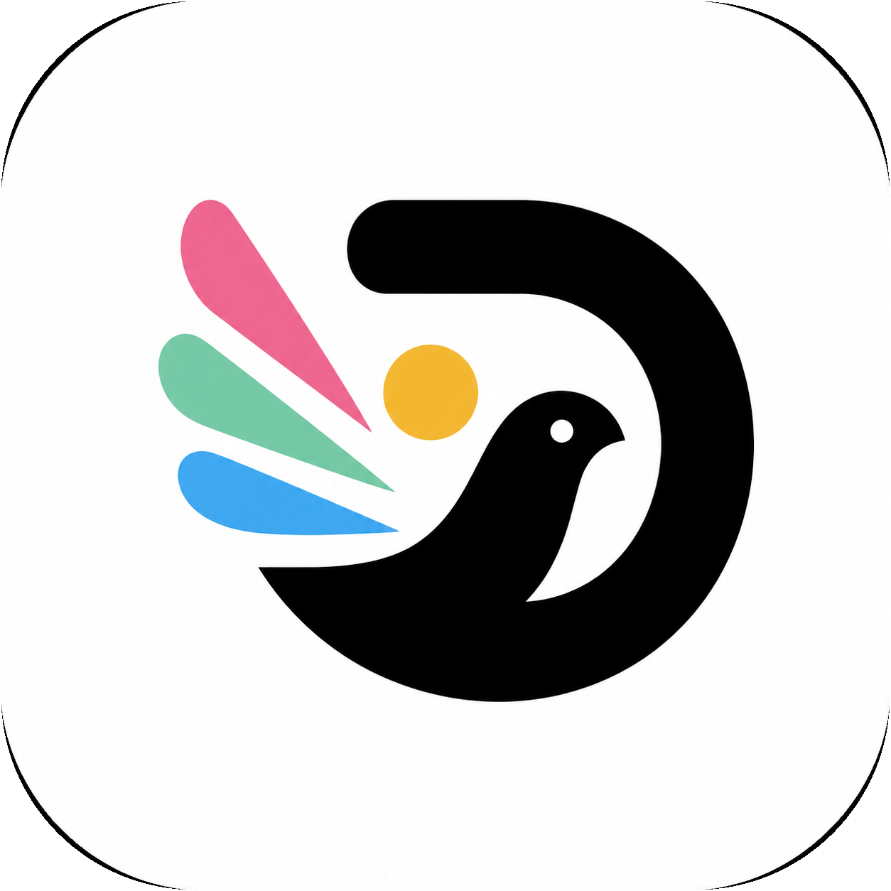
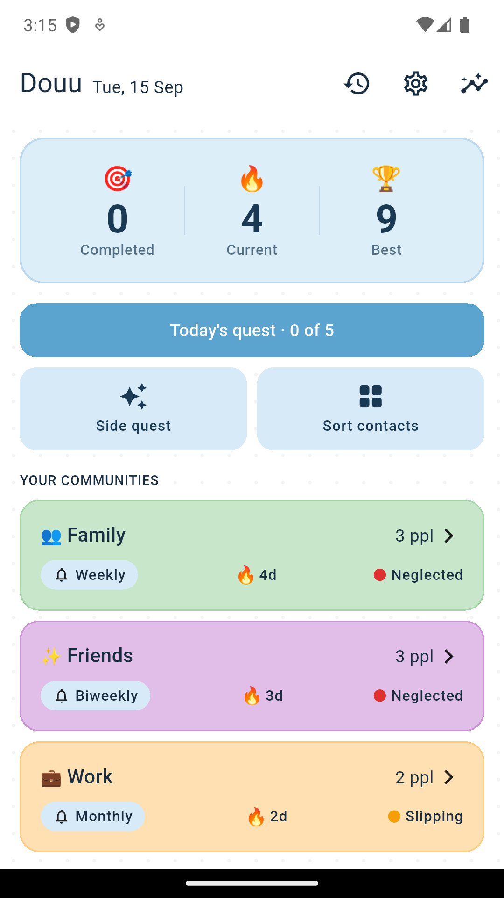

<p align="center">
  
</p>

<h1 align="center">Douu</h1>

<p align="center"><strong>A gentle, private way to stay close to your people.</strong></p>

<p align="center">
  
  
  
</p>

Douu helps you turn good intentions into small, manageable moments of connection. Choose the contacts who matter, organise them into communities, and let a flexible Daily Quest suggest who is due for a hello. One tap opens WhatsApp when you decide the timing is right.

<p align="center">
  
</p>

## Why Douu

- **Your people, your rhythm.** Create communities such as Family, Friends, or Work, then set the reconnection cadence that feels right for each one.
- **Daily Quests that rotate.** Reach out to any few people from the day’s list. Skips are remembered, completed people do not reappear in the same quest, and recent people rotate out when possible.
- **A soft nudge, never pressure.** Optional reminders respect quiet hours. Douu can also ask a simple sorting question, such as “Is Priya part of Family?”
- **WhatsApp on your terms.** Douu opens a chat only after you choose a person. Optional message starters are editable.
- **Private by design.** Contacts, groups, notes, settings, and history live in a local SQLite database. There is no account, analytics, advertising SDK, server, or internet permission.
- **You own the backup.** Export a passphrase-protected backup when you choose, then restore it on your own device.

## Run it locally

### What you need

- Flutter **3.22+**
- Dart **3.4+**
- Android Studio and an Android device or emulator
- Java **17** for Gradle

```bash
git clone https://github.com/ajitcsn/Douu.git
cd Douu
flutter pub get
flutter run
```

To run the checks used for this repository:

```bash
flutter analyze
flutter test
flutter build apk --debug
```

If you change Drift database tables, regenerate the checked-in database code:

```bash
dart run build_runner build --delete-conflicting-outputs
```

## Build a Play-ready Android bundle

Release builds must be signed with a private upload key. Copy the safe template, replace every placeholder, and keep the real file and keystore out of Git.

```bash
cp android/key.properties.example android/key.properties
flutter build appbundle --release
```

The generated bundle is at `build/app/outputs/bundle/release/app-release.aab`. See [Android app signing](https://developer.android.com/studio/publish/app-signing) before creating or rotating an upload key.

## How it is built

| Area | Choice |
| --- | --- |
| App | Flutter and Dart |
| State and navigation | Riverpod and go_router |
| Local data | Drift on SQLite |
| Reminders | flutter_local_notifications, timezone, WorkManager catch-up |
| Messaging | User-initiated WhatsApp deep links |
| Backup | Manual, passphrase-protected AES-GCM export |

```
lib/
├── data/       Local Drift database and repository
├── domain/     Quests, reminders, health, backups, contact import
├── features/   Onboarding, home, communities, quests, insights, settings
├── shared/     Reusable UI pieces
└── main.dart   App entry point
```

## Privacy

Douu is deliberately local-first. It reads contacts only after permission is granted, stores selected information on the device, and opens WhatsApp only from an action you take. Exported backups are created only when you ask to share one.

Read the full [privacy policy](docs/privacy.html).

## Contributing

Issues and pull requests are welcome. Before submitting a change, run `flutter analyze` and `flutter test`. Please keep the local-only promise intact: do not add network access, telemetry, or an `INTERNET` permission.

## License

No license has been chosen yet. Do not assume permission to reuse this code beyond what applicable law allows.
